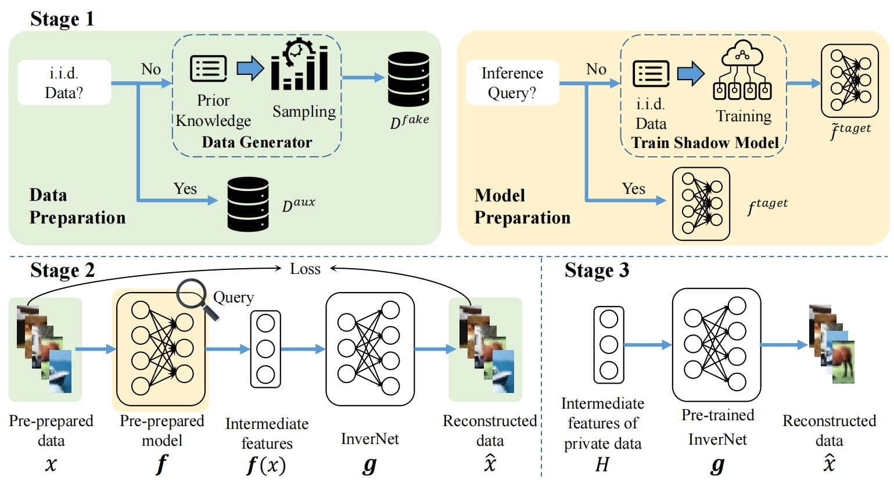

# 表格数据在VFL上的数据重建

## 1. 论文实现阶段

粗略的时间安排

| 起止日期                 | 主要研究内容                                                 |
| :----------------------- | :----------------------------------------------------------- |
| 2023-03-01 至 2023-04-01 | 结合表格数据特有的分布特征，针对表格数据提出优化的攻击方法   |
| 2023-04-01 至 2023-04-15 | 根据所提出的针对表格数据的数据重建攻击方法，提出相应的防御方法 |
| 2023-04-15 至 2023-05-01 | 针对本研究所关注的场景，基于现有的指标，提出数据泄露和数据恢复评价指标，用于实验效果的评估 |

## 2. 攻击设计规划

整个攻击方法的设计就持续5周，这5周必须争分夺秒！！！

时间非常紧迫！！

### 2.1 攻击1

攻击思路 白盒攻击

使用方法，来自于核心文章那篇：

尝试构建表格的预训练模型，放入攻击中，少量同分布数据用于恢复

第一步：设计一些特殊的损失函数，保证符合表格的特征

### 3-10

今天工作安排：

1. 测试是否可以使用pycharm远程使用服务器上的数据1h
   - 结论是可以使用服务器上的数据的！   30min基本完成
2. 将学长的VFL跑起来
   - 复现和学长相同的效果1h
     - 结果是auc效果达到了0.88
   - 使用avazu数据集1h 未完成

### 3-11

今日工作安排：
1. 使用avzue数据集1h 4点前完成
2. 完成白盒攻击的实现-使用迭代的方法  2-3h  会宿舍前完成

### 3-16

目前主要完成了本周的规划

- 需要优化实验代码，跑出第一组数据
  - 甚至可以考虑如下设计：白盒原版-->白盒束约束-->GNR 期间加上对表格loss

### 3-17
先完成3种攻击方法

只考虑其中第一个数据的恢复

现在有一个抉择：

1. 将三种攻击方法打包为一个工具，代码量会增加
2. 保持现状，只要实验结果

先阶段我需要是论文，而不是专利，不需要打包，逐一实现即可，重点其实是在论文上！

#### 梳理重要的超参数

去除没有必要的参数。时间：3点前

#### 总结

**基础攻击模型已经结束**
一共设计了3种优化模型，优化的方式见代码

### 基础攻击模型已经结束

## 3. 准备实验数据

在中原数据集上完成规范化、非规范化两类数据的研究：

- 非规范化（这个应该是不太常见的场景）
  1. 超参数调优，找到最佳超参数
  2. 找到前200个数据的恢复效果
  3. 2,3,4层都测试

- 规范化
  1. 完成规范化数据和非规范化数据转换的代码
  2. 同样完成前200个数据的恢复
  3. 2,3,4层都测试

其他数据集：

参考连接：
https://img-blog.csdnimg.cn/42f97e0ccae247e3a90e3b4d22f6b733.png?x-oss-process=image/watermark,type_ZmFuZ3poZW5naGVpdGk,shadow_10,text_aHR0cHM6Ly9ibG9nLmNzZG4ubmV0L0xXVDk4MzY=,size_16,color_FFFFFF,t_70

### 3-23
完成非规范化数据上的：
0. 基础代码编写
1. 超参数调优
2. 跑完2-4层数据

有一个考虑：
规范化后，就没有可以使用的特殊loss了，增加了一个norloss效果反而很差，不如不用，就离谱
有没有必要将xGen逆规范化回去，再使用之前设计的loss呢？

### adult数据实验
参考的实现方法：
https://blog.csdn.net/weixin_53598445/article/details/122113615
目标4-17日完成

